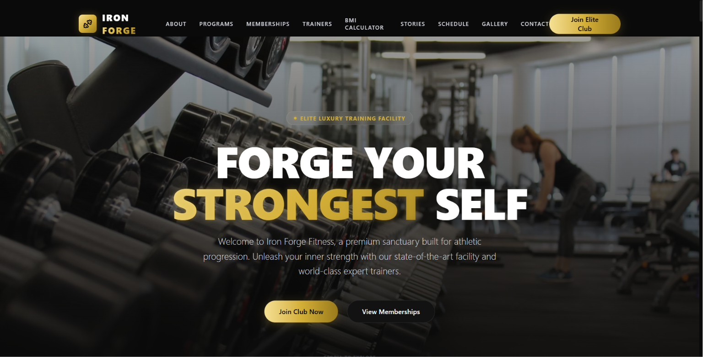
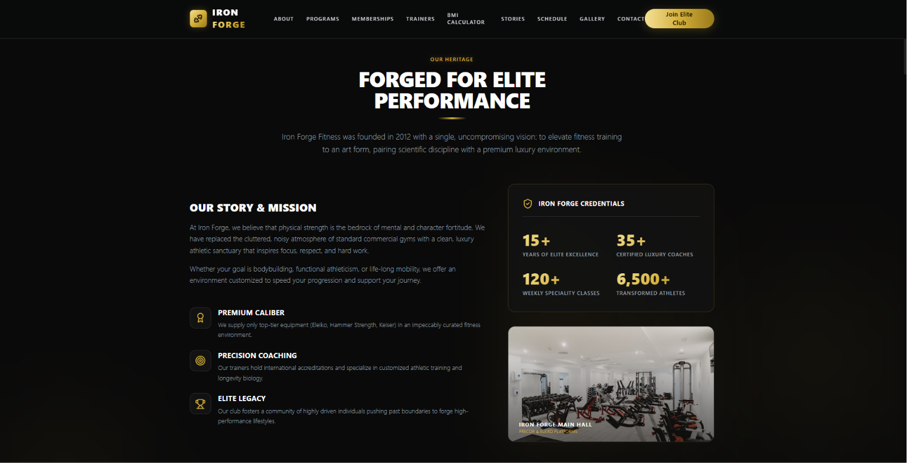
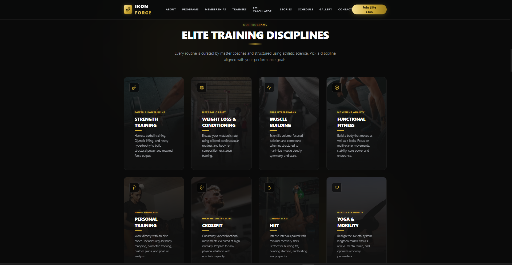
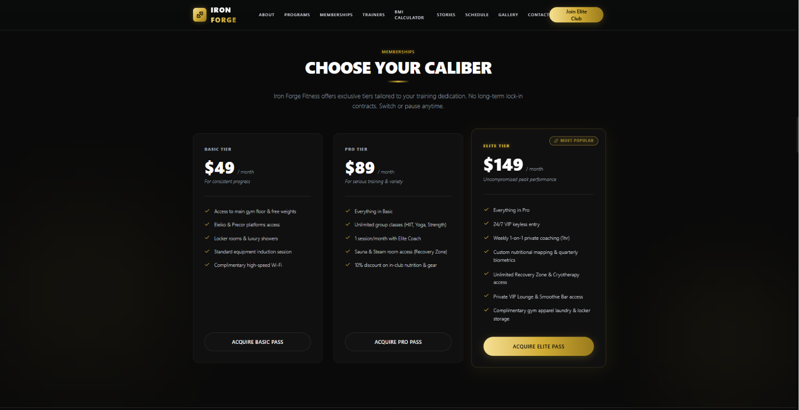
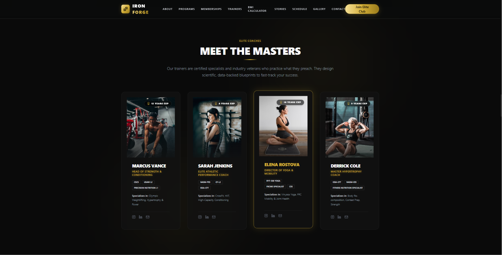
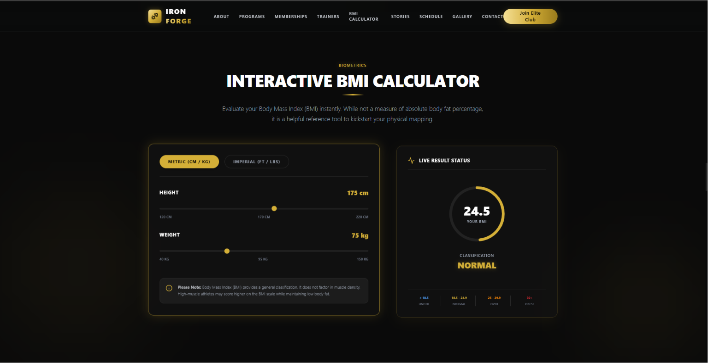
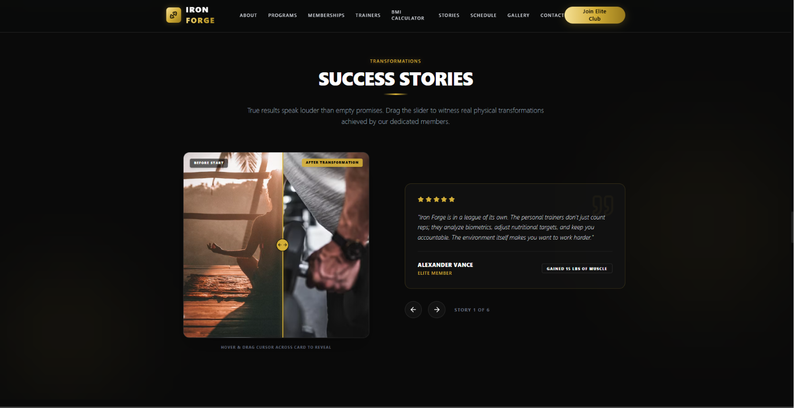
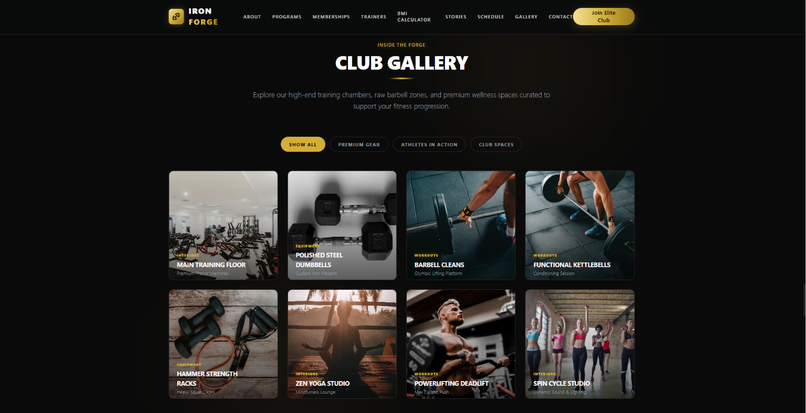
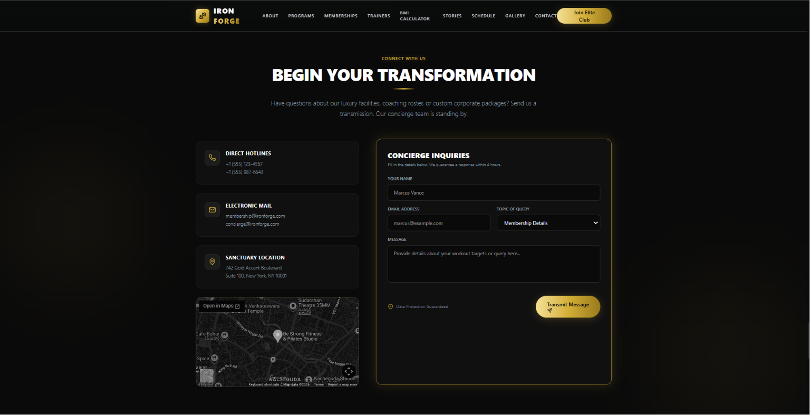
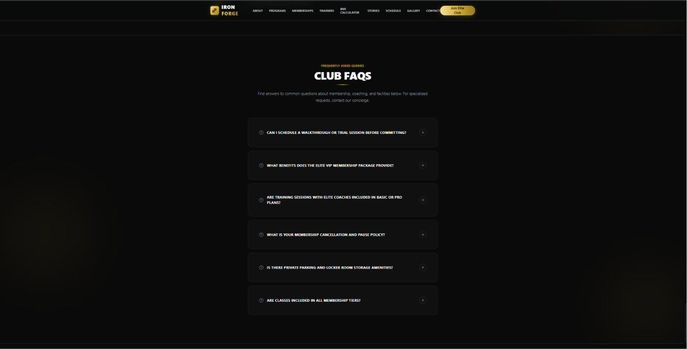

# 🏋️ Iron Forge Fitness

A premium, fully responsive fitness and gym website designed for modern fitness centers, personal trainers, and luxury health clubs. Built with Next.js, TypeScript, Tailwind CSS, and Framer Motion to deliver an immersive, high-performance user experience.

🔗 **Live Demo:** https://iron-forgee-fitness.vercel.app

---

# 📖 About the Project

Iron Forge Fitness is a premium landing website created for modern gyms and luxury fitness clubs.

The website showcases training programs, memberships, expert trainers, BMI calculator, transformation stories, schedules, and contact information through an elegant user interface with smooth animations and responsive layouts.

This project demonstrates professional frontend development skills including responsive design, reusable component architecture, advanced animations, modern UI/UX principles, and production deployment.

---

# ✨ Features

### 🏋️ Hero Section

- Premium animated landing page
- Full-screen hero banner
- Call-to-action buttons
- Smooth entrance animations

### 💪 Training Programs

- Strength Training
- Functional Fitness
- HIIT Programs
- Cardio Sessions
- Yoga & Mobility
- Personal Coaching

### 💳 Membership Plans

- Multiple pricing plans
- Membership comparison
- Premium membership section
- Call-to-action cards

### 👨‍🏫 Expert Trainers

- Professional trainer profiles
- Experience highlights
- Specializations
- Certifications showcase

### ⚖️ BMI Calculator

- Interactive BMI calculator
- Instant health status
- Responsive calculations
- User-friendly interface

### 📅 Schedule

- Weekly class schedule
- Workout timetable
- Training sessions
- Organized layout

### 🖼 Gallery

- Modern fitness gallery
- High-quality imagery
- Responsive image grid
- Smooth hover effects

### 📞 Contact

- Contact form
- Google Maps integration
- Gym information
- Business hours

### 🎨 User Experience

- Fully responsive
- Mobile-first design
- Smooth page animations
- Scroll effects
- Elegant typography
- Luxury color palette

---

# 🛠 Tech Stack

## Frontend

- Next.js
- React
- TypeScript
- Tailwind CSS
- Framer Motion

## UI & Styling

- Responsive Design
- CSS Grid
- Flexbox
- Modern Animations

## Deployment

- Vercel

---
# 📸 Screenshots

### 🏠 Home & About

| Home | About |
|------|-------|
|  |  |

---

### 💪 Programs & Memberships

| Programs | Memberships |
|----------|-------------|
|  |  |

---

### 👨‍🏫 Trainers & BMI Calculator

| Trainers | BMI Calculator |
|-----------|----------------|
|  |  |

---

### ⭐ Success Stories & Schedule

| Success Stories | Schedule |
|-----------------|----------|
|  |  |

---

### 🖼 Gallery & Contact

| Gallery | Contact |
|----------|----------|
|  |  |

---

### ❓ FAQ

| FAQ |
|------|
|  | 

---

### 📱 Mobile View

| Mobile Preview |
|----------------|
|  |

---

# 📂 Project Structure

```text
iron-forge-fitness
│
├── public
│
├── src
│   ├── app
│   ├── components
│   ├── data
│   ├── hooks
│   ├── lib
│   └── styles
│
└── screenshots
```

---

# ⚙️ Installation

## Clone the repository

```bash
git clone https://github.com/Pulipati-Rahul/iron-forge-fitness.git
```

## Navigate into the project

```bash
cd iron-forge-fitness
```

## Install dependencies

```bash
npm install
```

---

# ▶️ Running the Project

```bash
npm run dev
```

Runs on

```
http://localhost:3000
```

---

# 🌍 Live Deployment

Live Website

https://iron-forgee-fitness.vercel.app

---

# 💡 What I Learned

While building this project, I learned:

- Building production-ready Next.js applications
- Creating reusable React components
- Responsive UI design
- Advanced Tailwind CSS techniques
- Framer Motion animations
- Performance optimization
- Git & GitHub workflow
- Vercel deployment
- Professional UI/UX design

---

# 🚀 Future Improvements

- Online membership registration
- Payment gateway integration
- Trainer booking system
- Workout tracking dashboard
- User authentication
- Nutrition planner
- AI workout recommendations
- Dark / Light theme
- Blog section
- Admin dashboard

---

# 👨‍💻 Author

**Pulipati Rahul**

Full Stack Developer

GitHub

https://github.com/Pulipati-Rahul

LinkedIn

https://www.linkedin.com/in/pulipatirahul

Portfolio

https://pulipatirahul.vercel.app

---

# ⭐ Support

If you found this project helpful, consider giving it a ⭐ on GitHub.

It motivates me to continue building high-quality projects.
